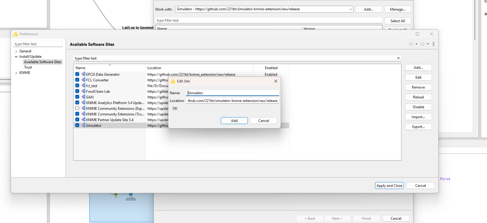
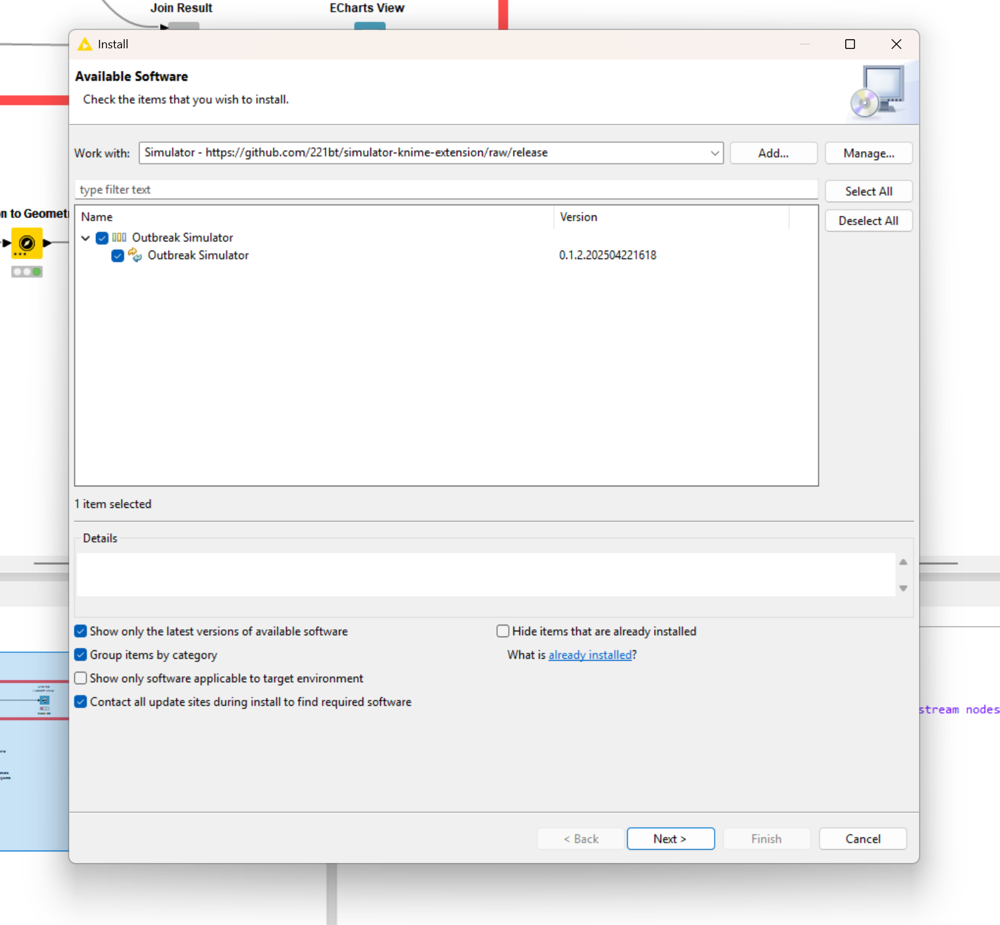
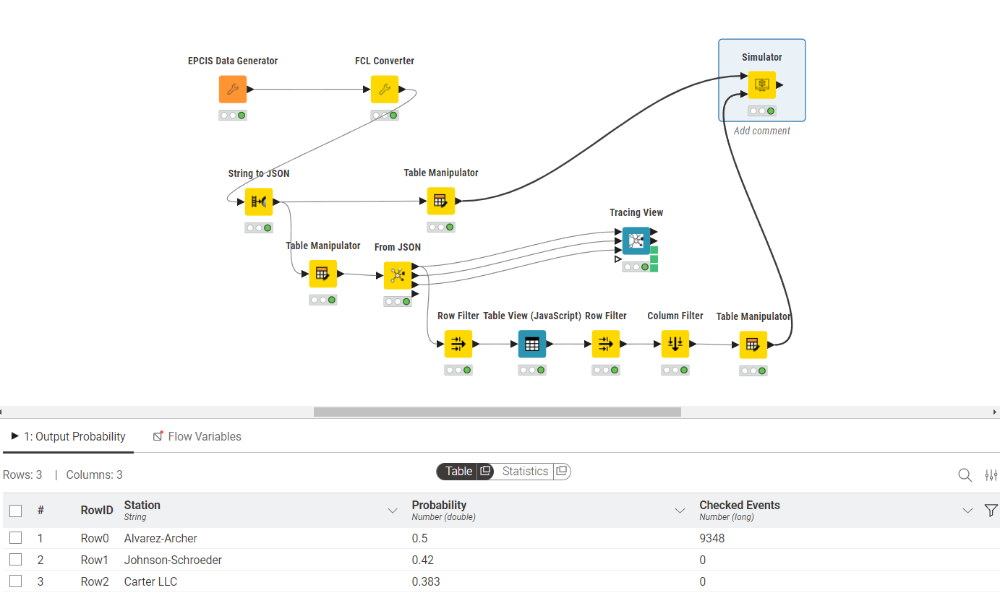

# KNIME Node: Food Supply Chain Foodborne Illness Outbreak Investigation Using Hybrid Simulation

## Overview
This repository contains a groundbreaking KNIME node for automated foodborne outbreak investigation, leveraging a first-of-its-kind hybrid simulation to detect the root cause of outbreaks with unprecedented accuracy and efficiency. Our solution integrates seamlessly into your investigative workflows, enabling rapid identification of probable farm sources by analyzing outbreak patterns and providing probabilistic root cause assessments.

## Key Features
1. **Innovative Hybrid Simulation**: Combines Discrete Event Simulation (DES) and Monte Carlo Simulation to model complex supply chain dynamics, capturing both event-driven processes and probabilistic uncertainties in food distribution.

2. **Trace-Forward Approach**: Unlike traditional trace-back methods, our trace-forward simulation incorporates time-sensitive factors, accounting for the perishable nature of food products and their lifecycle, resulting in faster and more precise outbreak source identification.

3. **GS1 EPCIS V2 Compliance**: Utilizes standardized supply chain data formatted to the GS1 EPCIS V2 standard, ensuring interoperability, consistency, and reliability across diverse data sources in global food supply chains.

4. **KNIME Integration**: Packaged as a user-friendly KNIME node, enabling easy integration into automated investigation pipelines for streamlined, scalable outbreak analysis.

## Getting Started

1. Download and install/unzip the latest version of [KNIME](https://www.knime.com/downloads).
2. Select **Help > Install New Software** in the menu bar. And click **Add**, in the upper right corner.
3. In the Add Repository dialogue that appears, enter "EPCIS GAN Data Generator" for the Name and the following URL for the Location: https://github.com/221bt/simulator-knime-extension/raw/release. Click **Add**.

4. In the Available Software dialogue, expand the "EPCIS 2.0 Document Generator by GAN" entry and select the checkbox next to "EPCIS 2.0 Document Generator by GAN". Click **Next**.

5. In the next window, you’ll see a list of the tools to be downloaded. Click **Finish**.
6. If a window "Trust Authorities" pops up, please tick the checkbox in the upper left corner next to "https://github.com/221bt" and click **Trust Selected**.
7. If a window pops up asking whether you trust unsigned content, please tick the checkbox in the upper left corner next to “Unsigned” and click **Trust Selected**.
8. When the installation completes, restart KNIME.
9. When the KNIME interface has shown up, you should be able to see an item "GAN Generator" in the **Node Repository** view in the bottom-left corner.And you can find them under *Community Node -> 221bt*. To run the full example workflow, please install FoodChain-Lab KNIME extension from [this site](https://foodrisklabs.bfr.bund.de/installation/) and FCL Converter from [this site](https://github.com/221bt/knime_extension)

## Benefits

1. **Enhanced Accuracy**: The hybrid simulation models real-world supply chain complexities, including variable transit times, batch splitting, and cross-contamination risks, delivering more accurate root cause probabilities than traditional methods.
2. **Speed and Scalability**: Automates the labor-intensive process of outbreak investigation, reducing analysis time from days to hours and enabling rapid response to mitigate public health risks.
3. **Proactive Risk Identification**: The trace-forward approach identifies potential outbreak sources before they propagate further, supporting early intervention and containment.
4. **Robust Decision Support**: Provides probabilistic outputs that quantify uncertainty, empowering investigators with clear, data-driven insights to prioritize resources and actions.
5. **Adaptability**: Handles diverse supply chain scenarios, from local farms to global networks, making it versatile for various foodborne pathogens and outbreak scales.
